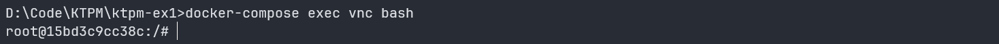
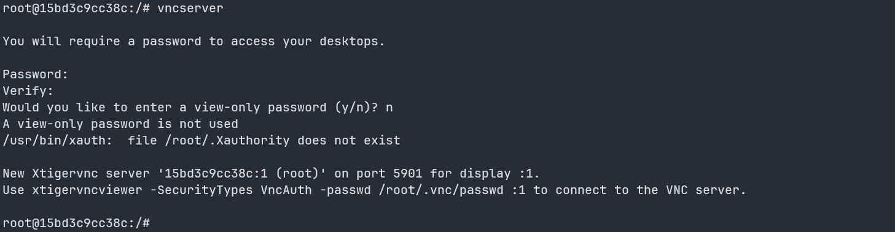
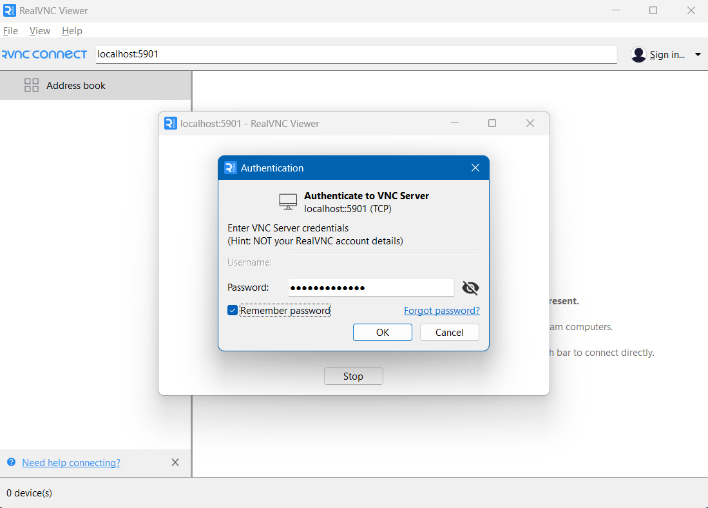
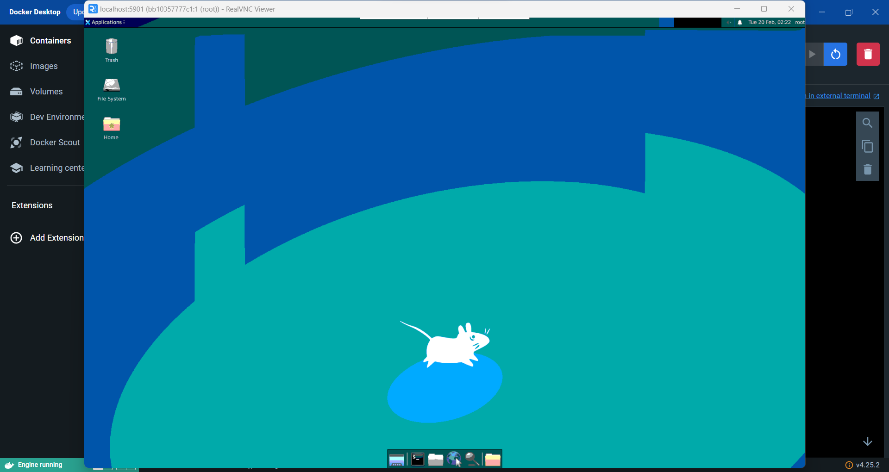

# Nội dung
Hướng dẫn cài đặt Desktop Environment và VNC cho một image Ubuntu để có thể remote từ Desktop trên HĐH Windows.

# Yêu cầu
- Đã có sẵn [Docker](https://docs.docker.com/desktop/install/windows-install/) và [RealVNC Viewer](https://www.realvnc.com/en/connect/download/viewer/) trên máy.

# Thực hành

## Bước 1: Build image và tạo container
Từ thư mục gốc chạy lệnh `docker-compose up -d` . Sau khi chạy xong ta sẽ có một image đã chứa sẵn Desktop Environment và VNC.
Giải thích về các nội dung tệp Dockerfile:
- `FROM ubuntu:22.04`: Sử dụng ubuntu phiên bản 22.04 làm base image.
- `RUN apt install -y xfce4 xfce4-goodies`: Sử dụng xfce4 làm desktop environment.
- `RUN apt install -y tigervnc-standalone-server`: Sử dụng tigervnc làm VNC.

## Bước 2: Setup VNC
- Từ thư mục gốc chạy lệnh `docker-compose exec vnc bash`, khi đó terminal sẽ trông như sau
	
- Chạy lệnh `vncserver`, tiếp theo đó điền password và tuỳ chọn `n`
	
- Chạy lệnh `vncserver -kill :1` để tắt VNC, sau đó `nano ~/.vnc/xstartup` và copy nội dung từ file [xstartup](xstartup) ở thư mục gốc của repo. Chọn `Ctrl + X` để lưu lại.
- Chạy lệnh `chmod +x ~/.vnc/xstartup` để cấp quyền cho file.
- Cuối cùng mở RealVNC Viewer trên Desktop và kết nối tới địa chỉ `localhost:5901` và nhập mật khẩu để truy cập.
	
## Kết quả

